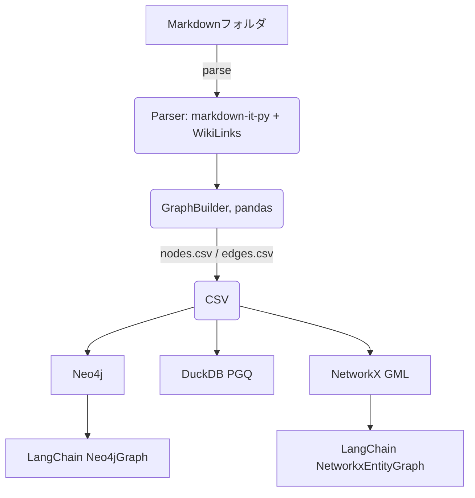

# md2kg – 技術仕様書 (MVP)

最終更新: 2025‑05‑31（Asia/Tokyo）

---

## 1. 目的

Markdown で書かれたドキュメント（フォルダ一式）を対象に、**WikiLinks** (`[[Page Title]]`) で張られた明示的リンク構造を抽出し、汎用的に扱える **Knowledge Graph (KG)** へ変換する CLI ツールを開発し、一般提供する。まずは以下を最小要件とする。

1. 解析 → `nodes.csv` / `edges.csv` 出力（共通スキーマ）
2. **Neo4j** および **DuckDB + PGQ 拡張** (DuckPGQ) への読み込みが可能な CSV であること
3. **LangChain `NetworkxEntityGraph.from_gml`** で読み込み可能な NetworkX の GML 形式への変換が可能な CSV であること

---

## 2. MVP で実現すること

- Python 3.10 以降、単一バイナリ配布 (pip install md2kg で完結)
- CommonMark + WikiLinks パーサ (`markdown‑it‑py` + WikiLinks extensions)
- WikiLinks 記法による決定論的なリンクのみを扱い、AI 抽出は行わない
- 1 万ファイル程度をノート PC で処理できる性能
- Neo4j 5.x と DuckDB 1.30 以上（`duckpgq` 拡張込み）への読み込み
- NetworkX の GML 形式への変換と LangChain での利用

### MVP では扱わないこと

- GUI / VS Code プラグイン
- AI による関係抽出
- クラスタ／分散処理
- RDF/OWL 推論

---

## 3. アーキテクチャ概要



---

## 4. モジュール構成

- **parser.py**

  - `markdown-it-py` + WikiLinks プラグインで AST 生成
  - `Node` と `Edge` のデータクラスを返す

- **builder.py**

  - 重複のない ID (SHA‑256) を生成
  - YAML front‑matter の `tags:` を抽出しノード属性に追加

- **exporter.py**

  - `nodes.csv`, `edges.csv` を RFC 4180 準拠で出力

- **loaders/** ディレクトリ

  - **neo4j_loader.py**
    - Neo4j 用の CSV ローダー
    - `neo4j-admin database import` または Cypher `LOAD CSV` を実行
  - **duckpgq_loader.py**
    - DuckDB 用の CSV ローダー
    - `SELECT FROM` または `COPY FROM` でグラフテーブルを生成

- **converters/** ディレクトリ

  - **networkx_converter.py**
    - `nodes.csv` と `edges.csv` を NetworkX の GML 形式に変換
    - LangChain の `NetworkxEntityGraph.from_gml` で読み込み可能であること

- **cli.py**

  - `click` ベースの CLI。サブコマンド `parse`, `export`, `load`, `graph`

---

## 5. CLI 設計（例）

```bash
# 1) 解析と CSV 生成
md2kg parse docs/ --output kg_out/

# 2) Neo4j にロード
md2kg load kg_out/ --neo4j bolt://localhost:7687 --user neo4j --pass ****

# 3) DuckDB + PGQ にロード
md2kg load kg_out/ --duckpgq kg.duckdb

# 4) NetworkX グラフを起動し Python REPL へ
md2kg graph kg_out/
```

オプション例:

- `--include "*.md"` / `--exclude "archive/*"`
- `--frontmatter-tags` : YAML の `tags` をノードラベルとして扱う

---

## 6. データモデル (CSV)

`nodes.csv`

- `id` : ファイルパスとタイトルから生成した SHA‑256
- `title` : Markdown の第 1 見出しかファイル名
- `filepath` : 相対パス
- `labels` : カンマ区切り（デフォルトは `Document`）
- `tags` : セミコロン区切り

`edges.csv`

- `src_id` : リンク元ノードの `id`
- `dst_id` : リンク先ノードの `id`
- `type` : 固定値 `LINK`
- `context_snippet` : リンクを含む 100 文字程度の抜粋（検索用）

---

## 7. 依存関係管理と主要依存ライブラリ

- **uv** を使って依存関係を管理
  - https://github.com/astral-sh/uv
  - https://docs.astral.sh/uv/
- `markdown-it-py >= 3.0`
- `mdformat-wikilinks` または同等の WikiLinks プラグイン
  - https://tamir.dev/posts/adding-wikilink-support-to-mdformat/
- `pandas`, `click`, `pyyaml`
- `neo4j` ドライバ or `neo4j-admin` CLI
- `duckdb`, 拡張 `duckpgq`
- `networkx`
- `langchain`

---

## 8. パッケージングと配布

- **pyproject.toml** で `pdm` ビルド。エントリポイントは `md2kg=md2kg.cli:app`
- PyPI へ `md2kg` として公開
- GitHub Actions で Linux / macOS バイナリをビルド
- Dockerfile（Neo4j・DuckDB 同梱）を提供し GitHub Actions の CI でスモークテスト

---

## 9. テスト方針

- 単体テスト: 小さな Markdown スニペット → 期待リンク数を検証（pytest）
- プロパティテスト: Hypothesis でランダム生成した WikiLinks を往復変換
- 結合テスト: サンプル Vault (≈10 ファイル) を Neo4j にロードし、ノード数・エッジ数を比較
- CLI テスト: `click.testing.CliRunner` で主要コマンドを網羅
- CI: GitHub Actions で Python 3.10〜3.12 × OS マトリックス

テストファイルの命名規則:

- ファイル名は `{モジュール名}_test.py` の形式に統一すること（例: `parser_test.py`, `builder_test.py`）
- クラスやメソッド名は Python の標準的な命名規則に従う（例: `test_method_name`）

---

## 10. 納品物

- `md2kg/` パッケージ一式
- `README.md`（英語）
- `README.ja.md`（日本語）
- `example_mds/` と簡易ノートブック
- アーキテクチャ Mermaid 図
- GitHub Actions ワークフロー

---

## 11. 想定スケジュール

1. **Week 1**: リポジトリ初期化、パーサ実装、単体テスト
2. **Week 2**: Builder & Exporter 完成、CLI `parse`/`export`
3. **Week 3**: Neo4j Loader 実装、結合テスト
4. **Week 4**: DuckDB PGQ Loader と NetworkX converter 実装、CLI `load`/`graph`
5. **Week 5**: ドキュメント整備、サンプル、v0.1.0 リリース

---

## 12. 将来拡張案（参考）

- ローカル LLM による関係抽出
- RDF/Turtle エクスポーターで Ontotext GraphDB などに対応
- ファイルシステム監視によるインクリメンタル更新 (`md2kg watch docs/`)
- FastAPI + React による簡易 Web UI（Cypher 実行＆ネットワーク可視化）

---

以上が日本語版の最小実装仕様です。
